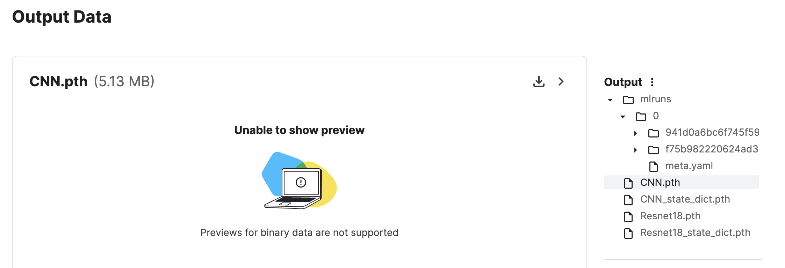

# Video Filter

## Intro
The model trained on the [Facial Detection](https://www.kaggle.com/datasets/tomng9/facialkeypointsdetection) on Kaggle.
You can find the notebook [here](https://github.com/callmeeric5/Video_Filter/blob/main/notebook/facial-keypoints-detection.ipynb). It contains the MLflow to record the experiment however the MLflow board can't be assessed from Kaggle

and try the [demo](https://videofilter.streamlit.app)

## Download

```
git clone git@github.com:callmeeric5/Video_Filter.git
```

## Run

```
cd Video_Filter/scripts
streamlit run main.py
```

